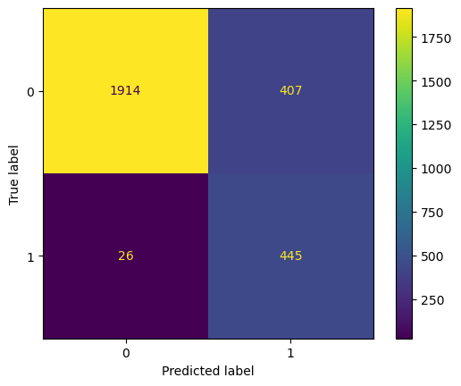

# HR_Analysis

### Objective:
The primary goal of this analysis was to identify the factors contributing to employee turnover at Salifort Motors and to build a predictive model to identify employees at risk of leaving the company. By understanding these factors, the HR department can take proactive measures to improve employee retention.

### North Star Metrics and Key Dimensions:

**Employee Turnover:** The rate at which employees leave the company

**Employee Satisfaction Level:**  The level of job satisfaction reported by employees, is crucial for understanding overall morale and predicting turnover.

**Employee Tenure:** The duration of time employees have spent with the company. Analyzing tenure helps identify when employees are most likely to leave.

**Promotion Rate:** The frequency of promotions within the last 5 years. A low promotion rate could indicate limited career growth opportunities, impacting employee retention.

**Work-Life Balance:** Evaluated through metrics like average monthly hours and work accidents, this dimension helps understand how work conditions might influence employee decisions to leave.

**Salary and Department:** Understanding how compensation and departmental affiliation impact turnover can guide more effective retention strategies.

 ### Summary of Insights:

- Employees with lower satisfaction levels are more likely to leave.
 
- Employees with tenure of 3-5 years, with a particularly high turnover rate at the 5-year mark. exhibit a higher likelihood of leaving
- The promotion rate is very low, at around 2%, and most employees who receive promotions do so after 6-7 years of tenure. Moreover, promotions are not consistently awarded to high-performing employees.
  
- Employees who have been promoted within the last 5 years are less likely to leave across all salary levels.
  
- Employees working excessive hours are more likely to leave, those working more than 280 hours per month face a turnover rate approaching 100%
  
- Turnover rates are relatively consistent across all departments, except for Management and R&D. 
This suggests that factors influencing turnover may be more related to company-wide policies or culture rather than specific departmental issues.

-  Salary still plays a significant role in employee retention.

### Actionable Recommendations
  

**Introduce Mini-Promotions:** Create "mini-promotions" that involve formal title changes to provide new challenges and responsibilities, without necessarily requiring a salary increase. This approach is based on the observation that employees who received promotions were less likely to leave, regardless of their salary level.

**Monitor Workload:** Regularly review and manage employee workloads, setting limits on the number of projects and encouraging the use of vacation days or flexible working options.

**Enhance Recognition Programs:** Establish a structured recognition program to regularly acknowledge and reward employees for their hard work and contributions, especially as they approach the 4-6 year mark with the company.

## Modeling Approach:

A logistic regression model was used to predict employee turnover. To address class imbalance, class weighting was applied.

**Model Performance**
===

**Accuracy:** 84% overall accuracy, meaning the model correctly predicted whether an employee would stay or leave 84% of the time.

**Precision and Recall:**
High precision (0.99) is used to predict employees who will stay, but lower precision (0.52) is used to predict those who will leave.
High recall (0.94) for predicting employees who would leave, meaning the model effectively identified most potential leavers.

**F1-Score:** Balanced F1-score (0.90) for predicting employees who would stay, but a lower F1-score (0.67) for predicting those who would leave, indicating room for improvement.

